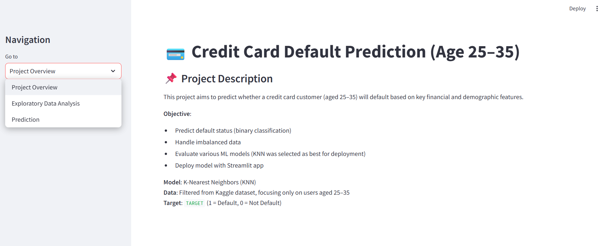
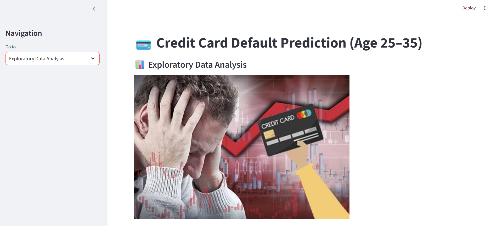
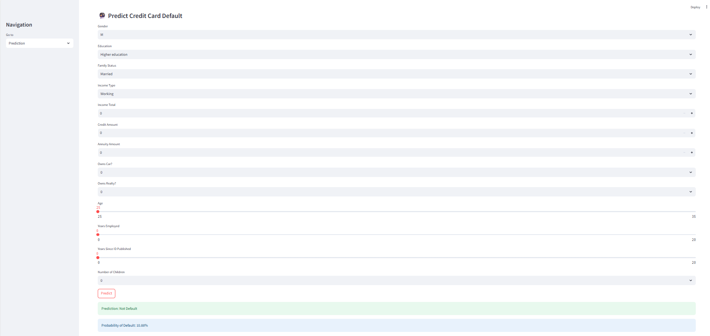

# **Credit Card Default Prediction using Supervised Learning (Binary Classification) for Young Generation**

## Repository Outline
deployment/
 app.py: application in streamlit
 eda.py: Exploratory Data Analysis (EDA) in streamlit
 prediction.py: prediction in streamlit
 model.pkl: model selected in this project (KNN)
description.md: information about this project
P1M2_Billy_Saputra_conceptual.txt: general information regarding bagging, boosting and cross validation
P1M2_Billy_Saputra.ipynb: jupiter notebook for ML modul development
P1M2_Billy_Saputra_inf.ipynb: jupiter notebook for testing the model
url.txt: link of data source and deployment
README.md: instruction regarding the project

## Problem Background
In the modern financial world, credit risk is one of the most significant concerns for banks and digital lending institutions. One key aspect of credit risk is default, where borrowers fail to repay their credit card obligations. This issue not only affects a financial institution’s profitability but also its long-term sustainability and trustworthiness in managing lending portfolios.

In the age of digital banking, BNPL (Buy Now Pay Later), and fintech platforms, predicting which customers are likely to default on their payments has become increasingly important. Therefore, with the right predictive models, financial service providers can take proactive steps such as early warning systems, credit limit adjustments, or personalized repayment plans, all while maintaining user satisfaction and minimizing losses.

## Project Output
The objective of this project is to:
- Build and evaluate a binary classification model to predict whether a customer will default on their credit card based on selected features.
- Handle imbalanced data (since defaults are much rarer than non-defaults).
- Compare various machine learning algorithms.
- Perform hyperparameter tuning and cross-validation to improve model performance.
- Deploy the final model for real-world usage through a simple interface or inference script.

## Data
The dataset used in this project comes from Kaggle:
- https://www.kaggle.com/datasets/mishra5001/credit-card

This dataset contains demographic, financial, and employment-related information of customers, along with the target column TARGET, which indicates whether the customer defaulted (1) or not (0). The original dataset consists of 122 columns, but in this project, we select 14 business-relevant features for simplicity, clarity, and model interpretability. In this project we only focus with customers age 25-35 y.o.

These selected features include variables such as income level, credit amount, annuity, employment history, age, education, and ownership status — all of which have strong correlation with real-world default risks based on OJK, World Bank, Mickinsey, and some related research.

## Method
This project uses Supervised Machine Learning techniques to perform binary classification, with the target being whether a customer will default on their credit card payments (TARGET = 1) or not (TARGET = 0).

The steps followed include:

1. Data Preprocessing:
- Selected 14 business-relevant features.
- Filtered data to focus on young adults (25–35 years old).
- Handled missing values and outliers.
- Transformed categorical features and grouped variables.

2. Handling Imbalanced Data: Applied SMOTENC (Synthetic Minority Over-sampling Technique for Nominal and Continuous) to balance the dataset while considering categorical features.

3. Model Training:
- Built pipelines with preprocessing and various classifiers (KNN, SVM, Decision Tree, Random Forest, XGBoost).
- Used 3-Fold Cross-Validation to evaluate models based on F1-Score, ROC AUC, and Recall.

4. Hyperparameter Tuning: Tuned the KNN model using GridSearchCV to find the best parameters for n_neighbors, weights, and p.

5. Final Evaluation: Evaluated the best model (KNN) using the test set with metrics like classification report, confusion matrix, and ROC AUC score.

6. Model Deployment: The final model is deployed in a Streamlit app.

## Stacks
1. Programming Language:
Python 3.10+

2.  Data Science & Machine Learning Libraries:
- pandas, numpy – Data manipulation and analysis
- scikit-learn – Modeling, preprocessing, pipelines, cross-validation, and metrics
- xgboost – Gradient boosting implementation
- imblearn – SMOTENC for handling imbalanced classes
- matplotlib, seaborn – Data visualization
- pickle – Model serialization

3. Web App / Dashboard: streamlit – For deploying the model and building an interactive UI

4. Others:
- Jupyter Notebook – Model development and experimentation
- Git & GitHub – Version control and project sharing

## Reference
Dashboard: 
Dashboard (Streamlit)
https://ccdefaultpred.streamlit.app/

Resource:
- https://thedocs.worldbank.org/en/doc/935891585869698451-0130022020/original/CREDITSCORINGAPPROACHESGUIDELINESFINALWEB.pdf
- https://oecd-opsi.org/wp-content/uploads/2022/01/does-the-visual-salience-of-credit-card-features-affect-choice.pdf
- https://www.mckinsey.com/~/media/McKinsey/Industries/Public%20and%20Social%20Sector/Our%20Insights/Lending%20responsibly%20New%20credit%20risk%20models%20for%20the%20unbanked/New_credit-risk_models_for_the_unbanked.pdf
- https://www.sciencedirect.com/science/article/pii/S2667345224000087

**Additional Reference:**
- [Basic Writing and Syntax on Markdown](https://docs.github.com/en/get-started/writing-on-github/getting-started-with-writing-and-formatting-on-github/basic-writing-and-formatting-syntax)
- [Contoh readme](https://github.com/fahmimnalfrzki/Swift-XRT-Automation)
- [Another example](https://github.com/sanggusti/final_bangkit) (**Must read**)
- [Additional reference](https://docs.streamlit.io/)